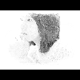

[](https://packagist.org/packages/pmvc-plugin/thumbnail) 
[](https://packagist.org/packages/pmvc-plugin/thumbnail) 
[](https://travis-ci.org/pmvc-plugin/thumbnail)
[](https://packagist.org/packages/pmvc-plugin/thumbnail)
[](https://packagist.org/packages/pmvc-plugin/thumbnail) 

thumbnail
===============


## How to use
   * https://github.com/pmvc-plugin/thumbnail/blob/master/demo/demo.php

## Thumb type
   * type 0 (New size not equal defined size)
      * New image size auto fit by ratio
      * Canvans size same with expected new image size
      * 
   * type 1
      * New image size auto fit by ratio.
      * Canvans will fill with background color, and width and height will same with defined.
      * 
   * type 2
      * New image will force to max one between width and height.
      * Canvans size same with defined size.
      * Auot change image location
      * 
   * type 3
      * Same with type2 but if image original size smaller than new size, will keep original one.
      * 
   * type 4
      * Same with type0 but if original size smaller than new size, will keep original one.
      * 
   * type 5
      * For security purpose, do 1:1 change. 
      * 


## Install with Composer
### 1. Download composer
   * mkdir test_folder
   * curl -sS https://getcomposer.org/installer | php

### 2. Install by composer.json or use command-line directly
#### 2.1 Install by composer.json
   * vim composer.json
```
{
    "require": {
        "pmvc-plugin/thumbnail": "dev-master"
    }
}
```
   * php composer.phar install

#### 2.2 Or use composer command-line
   * php composer.phar require pmvc-plugin/thumbnail

